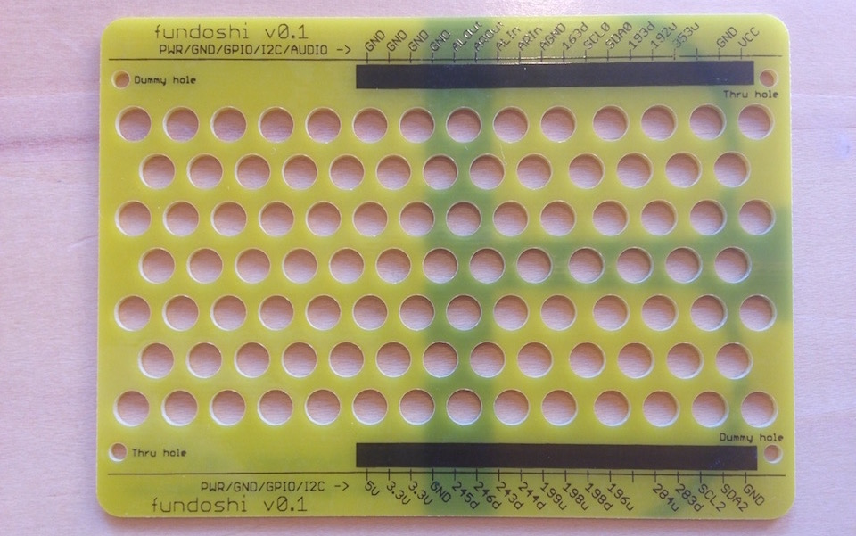

## desc

`fundoshi`はPCB1枚だけのシンプルなケースです。
上部は何もカバーせず底部のみカバーします。

## errata

v0.1及びv0.11にはFundoshiの印字に下記誤りがあります。

> v0.1のみ
>
> - CH1-8 が `198d` となっているが、`197d`の誤り
>
> v0.1、v0.11共通
> CH1-4 が `283d` となっているが、`283u`の誤り
> CH1-5 が `284u` となっているが、`284d`の誤り

上記誤りはv0.12で修正しています。

## design

Eagle 7.5で作成しています。詳細は下記を参照ください。

- [board(v0.12)](./eagle/CHIRIMEN-Fundoshi.brd)
- [Schematic(v0.12)※ブランクデータです](./eagle/CHIRIMEN-Fundoshi.sch)

### garber files

[Elecrow](https://www.elecrow.com/)用に出力したgarberファイルです。

- [v0.12](./garber-elecrow/v0.12)

## Make

[CHIRIMENにfundoshiを装着する (fabble)](http://fabble.cc/tadfmac/chirimen-fundoshi)

## License

[CHIRIME License](https://chirimen.org/license/)を参照ください。

