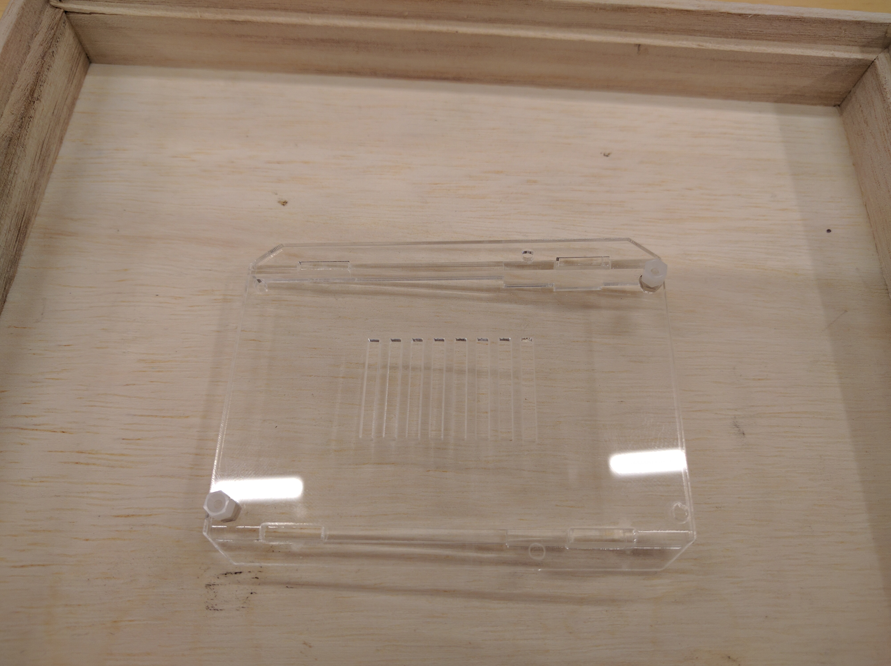
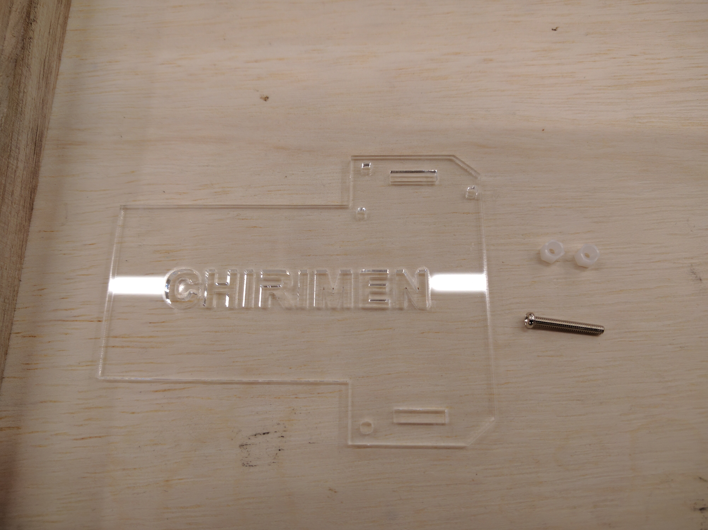
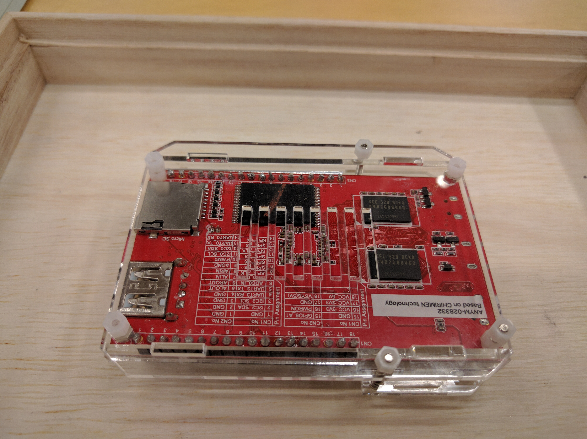
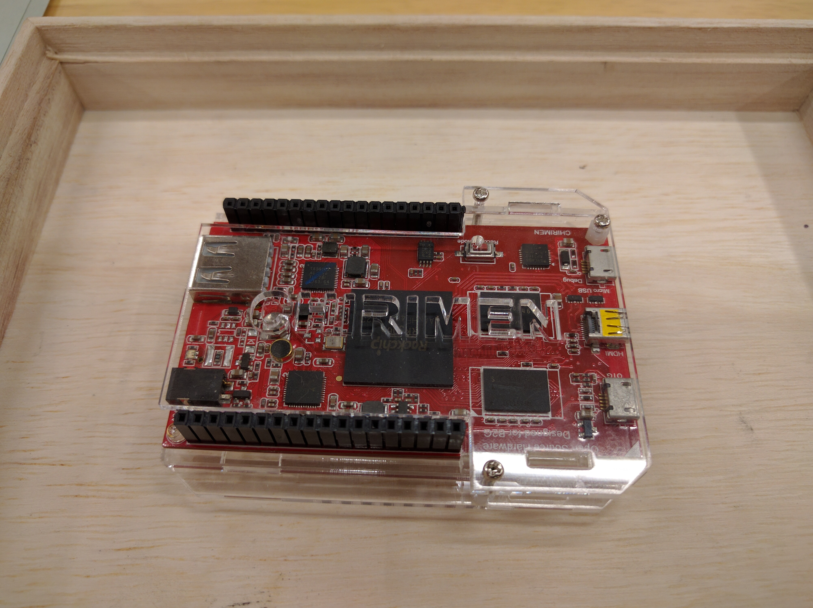

## Assembly Steps
1. About Parts
  * [Parts Lists](partsList-en.md) is Referred.
1. A board and acrylic parts are lined up.

1. Side stay is putted in Board (back : Exhaust heat duct) .

1. Nuts and screw is used Assembly parts.

1. 6mm length screw(2) is putted on Metal Nuts each 1.

1. 6mm length screw(2) is putted in Board (back : Exhaust heat duct) .

1. Board (back : Exhaust heat duct) is reversed, White Nuts is putted on screw.

1. 6mm length screw is putted at Around the point of a CHIRIMEN board Power Supply.

1. CHIRIMEN Board is reversed, White Nuts is putted on screw.

1. Board (front : Logo) and 15mm screw(1) White Nuts(2) stand by.

1. Like a Under Picture, Board (front : Logo) is putted in 15mm length screw(1) ,  
   After White Nuts is putted on screw.

1. And More, Like a Under Picture, Board (front : Logo) is putted in Hole of Recover Mode SW Right Side,  
  After White Nuts is putted on screw.

1. CHIRIMEN Board is reversed, Like a Under Picture.

1. Board (front : Logo) and Board (back : Exhaust heat duct) is picked up.  
  Like a Under Picture.

1. CHIRIMEN Board and Acrylic board(front and back) is reversed, Like a Under Picture.

1. Like a Over Picture, CHIRIMEN Board of The lower right side, White Nuts is putted on screw.

1. Reversed, Remaining these 15mm length screw is putted in Board (front : Logo).

1. One More Reversed, Remaining these  White Nuts is putted on these 15mm length screw(2).

1. At Last Reversed, Case is Assemblying to Finish.

